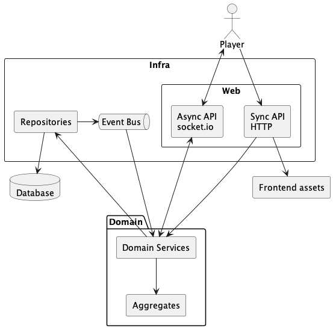
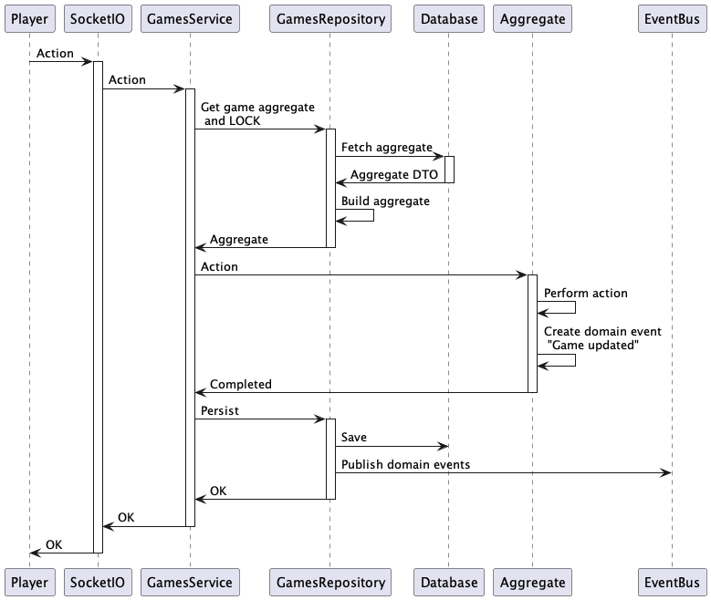
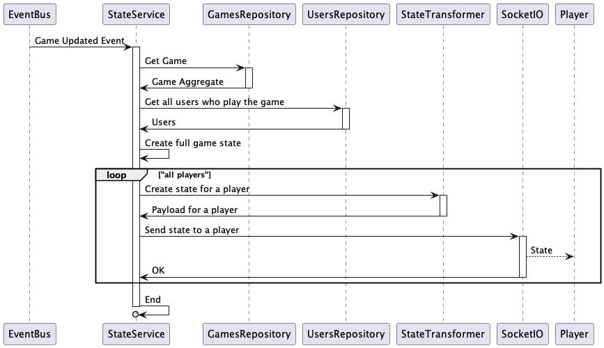

[](https://codecov.io/gh/Oberonus/planningpoker)

# Planning Poker

## What is it?

This is a simple implementation of a Planning Poker tool which is intended to help the Agile 
teams.

According to [wikipedia](https://en.wikipedia.org/wiki/Planning_poker), Planning poker, also called Scrum poker, is a consensus-based, gamified 
technique for estimating, mostly used for timeboxing in Agile principles. In planning poker, members 
of the group make estimates by playing numbered cards face-down to the table, instead of speaking 
them aloud. The cards are revealed, and the estimates are then discussed. By hiding the figures 
in this way, the group can avoid the cognitive bias of anchoring, where the first number spoken 
aloud sets a precedent for subsequent estimates.

## How to run

The service is fully dockerized, does not have any external dependencies and can be 
easily run locally with
```bash
docker-compose up
```

When the container is up and running, just visit the service at [http://localhost:8080](http://localhost:8080)

## Development

This service is built with Domain Driven Design, CQRS, event based communication, clean code and
hexagonal architecture in mind (yep, a lot of buzzwords here).

For now, it is a simple in-memory implementation of a planning poker tool 
with backend and frontend logic living in a single binary.

Languages used:
- Backend - Go
- Frontend - Vue.js

Protocols:
- Plain and simple HTTP
- Socket.io v1.x on top of the websocket protocol

### Overall architecture

The golang project is structured pretty much in a standard way, but a couple of things are worth to be mentioned:
- All the business logic lives in `internal/domain` directory
- All the infra related logic (http, websocket, database, etc...) lives in `internal/infra` directory.
- The frontend lives in `web` directory.

Golang app serves the frontend by itself, so no additional layer (e.g. NGINX) is needed.

#### Architecture diagram: 



The current implementation is extremely simple with in-memory Event Bus and database, but can be easily 
extended to support real storage.

### How it works

HTTP layer is used only to serve some basic auth related requests, all the game logic
utilizes the websocket protocol.

The best way to understand how things are working, is to dive deep in the codebase, but I believe 
following diagrams might make this process a bit easier.

### Actions
Any action in the gameplay are processed in the same way. 

Actions are:
- Create a new game
- Update game parameters
- Vote
- Un-vote
- Reveal cards (finish the game)
- Restart the game
- etc...

This sequence diagram describes how the process is working in general:



### Domain events processing

For now there are just a couple of domain events exist in the system:
- Player action (described in the previous section)
- Player changed name

Each event should be propagated to all players in order to reflect changes and display an actual
state of the game. 



### Frontend development

There is a possibility to run automatic watcher/builder for frontend:
```bash
./mage.sh devFront
```
It will spinup `node:14-alpine` container, mount all frontend codebase and
build right inside the container, avoiding any host dependencies.

### Running CI pipeline locally

The whole CI pipeline is dockerized and can be run with
```bash
./mage.sh ci
```

It will run:
- Linting
- Unit tests
- Component tests

Run only linting step:
```bash
./mage.sh lint
```

Run only unit tests:
```bash
./mage.sh testUnit
```

## Contribution
Your contribution is very welcomed! Please create pull request or issue.
