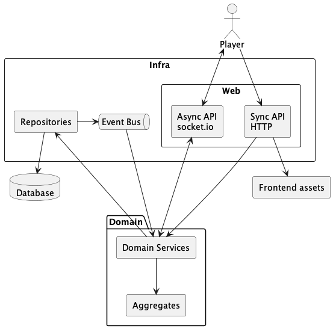
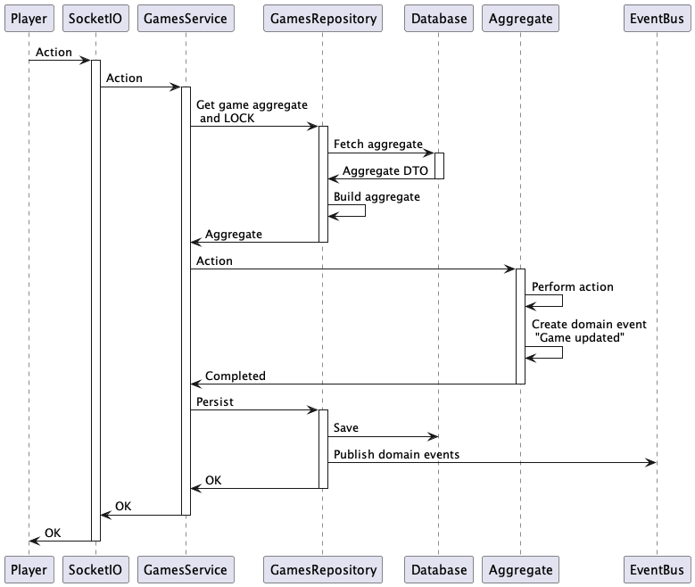
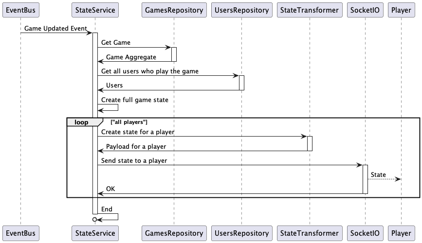

[](https://codecov.io/gh/Oberonus/planningpoker)

# Planning Poker

## What is it?

This is a simple implementation of a Planning Poker tool which is intended to help the Agile 
teams.

According to [wikipedia](https://en.wikipedia.org/wiki/Planning_poker), Planning poker, also called Scrum poker, is a consensus-based, gamified 
technique for estimating, mostly used for timeboxing in Agile principles. In planning poker, members 
of the group make estimates by playing numbered cards face-down to the table, instead of speaking 
them aloud. The cards are revealed, and the estimates are then discussed. By hiding the figures 
in this way, the group can avoid the cognitive bias of anchoring, where the first number spoken 
aloud sets a precedent for subsequent estimates.

## Try it out

Try Planning Poker at [poker.deminworks.com](https://poker.deminworks.com).
Create a game and share the invitation link with your team.

## Run locally

The service is fully dockerized. Compose runs the app and PostgreSQL locally:

```bash
docker compose up --build
```

When the container is up and running, just visit the service at [http://localhost:8080](http://localhost:8080)

## Deploy on your infrastructure

You can host Planning Poker on your own server using [Kamal](https://kamal-deploy.org/)
and the included configuration. The defaults target a single amd64 server, serve
HTTPS, and run PostgreSQL on the same host. Adapt the configuration to suit your
infrastructure.

You will need:

- Ruby 3.2 or newer and Docker on the computer you deploy from.
- A server reachable over SSH, with Docker available to your SSH user without sudo.
- A domain pointing to your server's public IP, with ports 80 and 443 reachable.

Install the supported Kamal version and copy the example deployment settings:

```bash
gem install kamal --version 2.12.0 --no-document
cp config/deploy.env.example .env.deploy
chmod 600 .env.deploy
```

Edit `.env.deploy` with your SSH host/user, application domain, and names for the
PostgreSQL service, container, and data volume. See
[the example settings](config/deploy.env.example) for the required variables.
For an existing database, keep its resource names unchanged so the configuration
continues to use the same data volume.

The local `./bin/deploy` wrapper loads `.env.deploy` from the project root and
exports its values for Kamal. The file is sourced as shell code; quote values
as needed. If it is absent, supply the same variables in your exported environment.
Deployment settings and secret files are ignored by Git; back them up privately.

Follow the [PostgreSQL setup guide](docs/postgres.md#provision-your-database)
to start the database and create the application's login and local secret files.
The supplied [database configuration](config/database.yml) manages PostgreSQL
separately from the app, so replacing the app does not replace its database.
You can also use a separately managed PostgreSQL instance by configuring
`DATABASE_URL` for it instead.

From the project root, with Docker running and SSH access to your server, set up
the first application deployment:

```bash
./bin/deploy setup
```

For subsequent deployments and operations:

```bash
./bin/deploy
./bin/deploy app details
./bin/deploy app logs
./bin/deploy rollback <previous-version>
```

Kamal builds the committed Git revision, so commit your application and
configuration changes before deploying. The supplied
[application configuration](config/deploy.yml) uses a local registry with image
transfer through SSH and checks `/alive` before switching traffic. Adjust the
build architecture and database resource limits for your server as needed.

For database administration, backups, and local integration tests, see the
[PostgreSQL guide](docs/postgres.md).

## Development

This service is built with Domain Driven Design, CQRS, event based communication, clean code and
hexagonal architecture in mind (yep, a lot of buzzwords here).

Backend and frontend logic live in a single binary, with PostgreSQL persistence.
Go 1.23 or newer is required for backend development.

Languages used:
- Backend - Go
- Frontend - Vue.js

Protocols:
- Plain and simple HTTP
- Socket.io v1.x on top of the websocket protocol

### Overall architecture

The golang project is structured pretty much in a standard way, but a couple of things are worth to be mentioned:
- All the business logic lives in `internal/domain` directory
- All the infra related logic (http, websocket, database, etc...) lives in `internal/infra` directory.
- The frontend lives in `web` directory.

Golang app serves the frontend by itself, so no additional layer (e.g. NGINX) is needed.

#### Architecture diagram: 



The event bus remains in memory. Games are stored as JSONB documents and users
in a relational table; memory repositories remain available for unit tests.

### How it works

HTTP layer is used only to serve some basic auth related requests, all the game logic
utilizes the websocket protocol.

The best way to understand how things are working, is to dive deep in the codebase, but I believe 
following diagrams might make this process a bit easier.

### Actions
Any action in the gameplay are processed in the same way. 

Actions are:
- Create a new game
- Update game parameters
- Vote
- Un-vote
- Reveal cards (finish the game)
- Restart the game
- etc...

This sequence diagram describes how the process is working in general:



### Domain events processing

For now there are just a couple of domain events exist in the system:
- Player action (described in the previous section)
- Player changed name

Each event should be propagated to all players in order to reflect changes and display an actual
state of the game. 



### Frontend development

There is a possibility to run automatic watcher/builder for frontend:
```bash
./mage.sh devFront
```
It will spinup `node:14-alpine` container, mount all frontend codebase and
build right inside the container, avoiding any host dependencies.

### Verification

Repository-wide coding conventions are in [AGENTS.md](AGENTS.md). The style check
enforces import grouping, blank-line spacing, and domain dependency boundaries:

```bash
golangci-lint run --config .golangci-style.yml ./...
```

Use golangci-lint v1.61.0, matching CI.

CI runs Go vet, unit and PostgreSQL integration tests with the race detector,
and a container smoke test. For local checks:

```bash
go vet -mod=vendor ./...
go test -mod=vendor -race ./...
```

See the [PostgreSQL guide](docs/postgres.md#local-development-and-verification)
for integration tests using a disposable database.

## Contribution
Your contribution is very welcomed! Please create pull request or issue.
